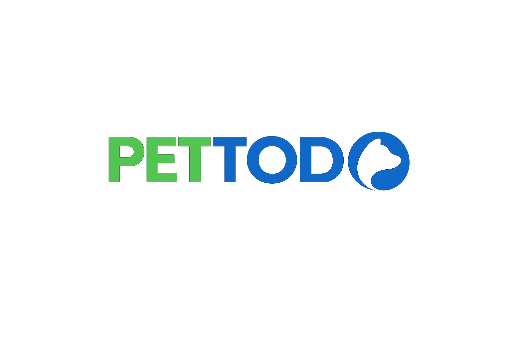

<p align="center">
  
</p>

# PETTODO
### Trust-Sensitive Infrastructure for Pet Care and Recovery

[](file:///d:/proyectos/PETTODO/GITHUB/Pettodo/docs/03_delivery/RELEASE_CRITERIA.md)
[](file:///d:/proyectos/PETTODO/GITHUB/Pettodo/docs/01_product/PILOT_COHABAMBA.md)

> "Because every second counts when they are lost, and every day matters while they are home."

PETTODO is a specialized platform designed to bridge the gap between daily pet care and the high-stakes urgency of recovery. It is built on a **trust-sensitive architecture** that prioritizes pet safety, owner privacy, and community coordination.

---

## 🌪️ The Problem
Losing a pet isn't just a logistical challenge—it's a moment of profound emotional crisis. Existing solutions are often fragmented: social media posts get lost in algorithms, physical flyers have limited reach, and generic "AI-apps" often lack the operational trust needed for safe handoffs.

On the other side, daily care (vaccines, feeding, health tracking) is often managed in disconnected notes or physically, making it hard to provide a complete "system of record" when an emergency actually hits.

## 🛡️ The PETTODO Solution: Dual-Mode Infrastructure

PETTODO operates in two distinct but interconnected modes to ensure continuity of care and speed of recovery.

### 🏠 1. Daily Care Mode (The 99%)
A robust system for the everyday life of your pet. By maintaining a real-time record of health and identity, you are always prepared for the unexpected.
- **Unified Health Profile**: Track vaccines, medications, and weight logs in a single source of truth.
- **QR Digital Identity**: Every pet gets a unique digital ID, ready to be scanned in case of emergency.
- **Feeding & Reminders**: Specialized gauges and presets to ensure consistent care.

### 🚨 2. Emergency Mode (The 1%)
A high-performance recovery engine that activates when a pet goes missing.
- **Privacy-Safe Reporting**: Generate reports with approximate locations to protect your home privacy.
- **Multi-Modal Matching**: Leveraging **Vertex AI (Gemini)** to identify potential matches based on visual traits and proximity.
- **Protected Contact Relay**: Secure communication between finders and owners without exposing sensitive personal data upfront.

---

## 🧩 Key Product Pillars

### 🤝 Trust-Sensitive Design
Unlike "open-wiki" platforms, PETTODO uses a **Controlled Governance** model. Sensitive changes to public records (like Community Dogs) require evidence and review to prevent misinformation and vandalism.

### 📍 Privacy-Aware Geospatial Logic
Exact coordinates are never exposed publicly. All lost/found cases use approximate bounding areas (~1km) to ensure community awareness without compromising individual security.

### 🤖 Intentional AI
AI is not our identity; it’s our engine. We use **multi-modal intelligence** for:
- **Photo Quality Guardrails**: Ensuring uploaded photos are clear enough for matching.
- **Similarity Analysis**: Ranking potential matches to save precious time during searches.
- **Automated Extraction**: Pulling structured traits from images to building better profiles faster.

---

## 🏗️ Technical Architecture

PETTODO is built with a modern, integration-ready stack designed for real-world reliability.

- **Frontend**: [React 18](https://reactjs.org/) + [Vite](https://vitejs.dev/) + [Tailwind CSS v4](https://tailwindcss.com/)
- **Backend**: [Node.js](https://nodejs.org/) + [Express](https://expressjs.com/)
- **Persistence**: [PostgreSQL](https://www.postgresql.org/) (Azure DB)
- **Identity**: [Firebase Auth](https://firebase.google.com/products/auth) (Google Sign-In)
- **Storage**: [Azure Blob Storage](https://azure.microsoft.com/en-us/services/storage/blobs/) (Encrypted media pipeline)
- **AI Layer**: [Vertex AI / Gemini](https://cloud.google.com/vertex-ai) (Provider-agnostic adapter pattern)

### Project Structure
```text
/src/app       # Mobile-first React application
/server        # Express API with role-based security
/docs          # Canonical source of truth (Product, Architecture, Trust)
/tests         # Comprehensive test suite (49+ integration tests)
```

---

## 🚀 Getting Started

### Prerequisites
- Node.js (v18+)
- PostgreSQL (Local or Azure)

### Local Setup
1. **Clone the repository**
2. **Install dependencies**:
   ```bash
   npm install
   ```
3. **Configure Environment**:
   Copy `.env.example` to `.env.local` and fill in your credentials (Firebase, Azure, DB).
4. **Run the application**:
   ```bash
   # Terminal 1: Frontend
   npm run dev
   
   # Terminal 2: API Server
   npm run api
   ```

---

## 📅 Roadmap & Vision
PETTODO is currently in **Active Pilot Readiness**.
- [x] Real Data Foundation (PostgreSQL/Azure)
- [x] Trust-Sensitive Protected Contact
- [x] Multi-modal Image Pipeline (Azure Blob)
- [/] **In Progress**: Full Matching Hardening
- [ ] **Coming Soon**: Neighborhood Trust Network & Expanded Pilot in Cochabamba.

---

## 📄 Documentation
For deeper insights, refer to our canonical documentation:
- [Product Vision](file:///d:/proyectos/PETTODO/GITHUB/Pettodo/docs/01_product/PRD_MVP_WEBAPP.md)
- [Trust & Safety Rules](file:///d:/proyectos/PETTODO/GITHUB/Pettodo/docs/01_product/TRUST_AND_SAFETY.md)
- [System Architecture](file:///d:/proyectos/PETTODO/GITHUB/Pettodo/docs/02_build/ARCHITECTURE.md)

---
Developed with ❤️ for pets and the people who care for them.
